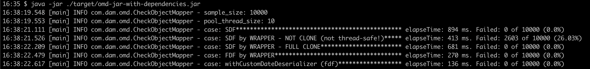
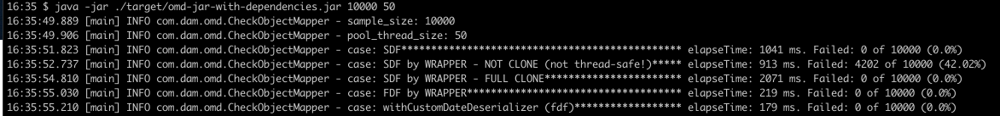

# jackson object-mapper custom SimpleDateFormat vs FastDateFormat Benchmark

## Purpose
Compare different ways to customize date deserializer for objectMapper.
One case is not <code>thread-safe</code> and generates incorrect dates.

## Definitions
- **SDF** = SimpleDateFormat
- **FDF** = FastDateFormat

Evaluate alternatives are
- **SDF**: objectMapper using setDateFormat of SDF.
- **SDF by WRAPPER - NOT CLONE (not thread-safe!)**: objectMapper using setDateFormat of a DateFormat wrapper using SDF, with wrong clone implemtation.
- **SDF by WRAPPER - FULL CLONE**: objectMapper using setDateFormat of a DateFormat wrapper using SDF.
- **FDF by WRAPPER**: objectMapper using setDateFormat of a DateFormat wrapper using FDF.
- **withCustomDateDeserializer (FDF)**: objectMapper using a custom module that defines a date deserializer with FDF.

## Technology
- maven 
- j11

## Test

`mvn install`
`java -jar ./target/omd-jar-with-dependencies.jar`

 `java -jar  ./target/omd-jar-with-dependencies.jar {sample_size} {pool_thread_size}`
 
 

